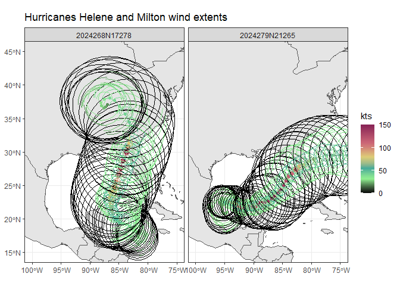
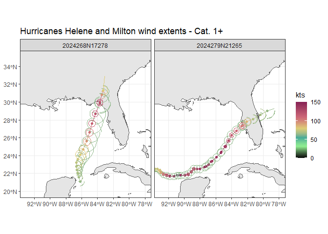

Cyclones
================
Ben Branoff
January 23, 2026

Ben Branoff 2026-01-20

R utilities for producing gridded representations of tropical cyclone
wind, precipitation, and storm surge.

Use the ‘get_storms’ function to gather the available time series and
wind information for a particular storm. If a local data source is
available, it can be used, either as the file location or as a
pre-loaded dataset. If not, the data will be downloaded from the web.

    ## ℹ Loading Cyclones

``` r
library(Cyclones)

##  storms can be singular or plural and can be identified specifically, or not
storms <- get_storms(source="hurdat",name="Maria",basin="NA",season=2017)
storms <- get_storms(source="hurdat",name=c("Maria","IRMA"),basin="NA",season=2017)
names(storms)

##  alternatively, all of the data can be downloaded and filtered later
##  downloading all storms will likely require extending the timeout time
##  options(timeout = 300)
allstorms <- get_storms(ib_filt="ALL")
storms <- allstorms |>
              slice(grep("HELENE_2024|MILTON_2024",ID))
```

With the data loaded, it can now be used to build rasters of wind,
precipitation, and/or storm surge, as well as a combined Tropical
Cyclone Severity Scale (TCSS) (Bloemendale et al. (2021)). If the Thin
Plate Spline (TPS) wind method is desired, models are built into a
lookup table (The empirical TPS method is shown below to be more
accurate than the theoretical models). These lookup tables should be
based on as full or limited a set of storms as necessary for the
objective. For generalized modeling, its best to use a full set of
storms.

``` r
## build the models based on the entire storm dataset.  The models are built into lookup tables, with a different model for every quadrant of the storm, for every storm size and in every basin. 
mods <- build_models(tracks=allstorms)
```

    ## Warning in build_models(tracks = allstorms): Empty models for some
    ## Basin:Category:Quadrant groups. Insuffucient data the likely cause for those
    ## groups.

These models will allow the reconstruction of certain wind extents when
missing, which is often the case for older (pre 2018) storms. Again, if
generalized wind fields are desired, the other non-TPS methods can be
used as explained further below. But if the objective is to create wind
field predictions specific to each quadrant and each basin and each
storm category based on the other storms in the data, we use these
models.

``` r
##  generate linestring and polygon wind extent features for each timestep in each storm
##  when used as shown below with multiple storms as an input, the functions will only perform the action on the first storm
windextents <- make_extent(storms,mods=mods)
```

    ## Warning in make_extent(storms, mods = mods): More than one storm in data. Only
    ## first will be used. Use lapply or a parallel equivalent over the .$data to
    ## repeat for multiple storms.

    ## Warning: `add_rownames()` was deprecated in dplyr 1.0.0.
    ## ℹ Please use `tibble::rownames_to_column()` instead.
    ## ℹ The deprecated feature was likely used in the Cyclones package.
    ##   Please report the issue at <https://github.com/BenBranoff/Cyclones/issues>.
    ## This warning is displayed once every 8 hours.
    ## Call `lifecycle::last_lifecycle_warnings()` to see where this warning was
    ## generated.

    ## Building Wind Extents: % 2.2Building Wind Extents: % 4.4Building Wind Extents: % 6.7Building Wind Extents: % 8.9Building Wind Extents: % 11.1Building Wind Extents: % 13.3Building Wind Extents: % 15.6Building Wind Extents: % 17.8Building Wind Extents: % 20Building Wind Extents: % 22.2Building Wind Extents: % 24.4Building Wind Extents: % 26.7Building Wind Extents: % 28.9Building Wind Extents: % 31.1Building Wind Extents: % 33.3Building Wind Extents: % 35.6Building Wind Extents: % 37.8Building Wind Extents: % 40Building Wind Extents: % 42.2Building Wind Extents: % 44.4Building Wind Extents: % 46.7Building Wind Extents: % 48.9Building Wind Extents: % 51.1Building Wind Extents: % 53.3Building Wind Extents: % 55.6Building Wind Extents: % 57.8Building Wind Extents: % 60Building Wind Extents: % 62.2Building Wind Extents: % 64.4Building Wind Extents: % 66.7Building Wind Extents: % 68.9Building Wind Extents: % 71.1Building Wind Extents: % 73.3Building Wind Extents: % 75.6Building Wind Extents: % 77.8Building Wind Extents: % 80Building Wind Extents: % 82.2Building Wind Extents: % 84.4Building Wind Extents: % 86.7Building Wind Extents: % 88.9Building Wind Extents: % 91.1Building Wind Extents: % 93.3Building Wind Extents: % 95.6Building Wind Extents: % 97.8Building Wind Extents: % 100

``` r
##  To apply the function to all storms, use lapply or a parallel equivalent (snowfall::sfLapply)
windextents <- lapply(storms$data,make_extent, mods=mods)
```

    ## Building Wind Extents: % 2.2Building Wind Extents: % 4.4Building Wind Extents: % 6.7Building Wind Extents: % 8.9Building Wind Extents: % 11.1Building Wind Extents: % 13.3Building Wind Extents: % 15.6Building Wind Extents: % 17.8Building Wind Extents: % 20Building Wind Extents: % 22.2Building Wind Extents: % 24.4Building Wind Extents: % 26.7Building Wind Extents: % 28.9Building Wind Extents: % 31.1Building Wind Extents: % 33.3Building Wind Extents: % 35.6Building Wind Extents: % 37.8Building Wind Extents: % 40Building Wind Extents: % 42.2Building Wind Extents: % 44.4Building Wind Extents: % 46.7Building Wind Extents: % 48.9Building Wind Extents: % 51.1Building Wind Extents: % 53.3Building Wind Extents: % 55.6Building Wind Extents: % 57.8Building Wind Extents: % 60Building Wind Extents: % 62.2Building Wind Extents: % 64.4Building Wind Extents: % 66.7Building Wind Extents: % 68.9Building Wind Extents: % 71.1Building Wind Extents: % 73.3Building Wind Extents: % 75.6Building Wind Extents: % 77.8Building Wind Extents: % 80Building Wind Extents: % 82.2Building Wind Extents: % 84.4Building Wind Extents: % 86.7Building Wind Extents: % 88.9Building Wind Extents: % 91.1Building Wind Extents: % 93.3Building Wind Extents: % 95.6Building Wind Extents: % 97.8Building Wind Extents: % 100
    ## Building Wind Extents: % 1.6Building Wind Extents: % 3.2Building Wind Extents: % 4.8Building Wind Extents: % 6.5Building Wind Extents: % 8.1Building Wind Extents: % 9.7Building Wind Extents: % 11.3Building Wind Extents: % 12.9Building Wind Extents: % 14.5Building Wind Extents: % 16.1Building Wind Extents: % 17.7Building Wind Extents: % 19.4Building Wind Extents: % 21Building Wind Extents: % 22.6Building Wind Extents: % 24.2Building Wind Extents: % 25.8Building Wind Extents: % 27.4Building Wind Extents: % 29Building Wind Extents: % 30.6Building Wind Extents: % 32.3Building Wind Extents: % 33.9Building Wind Extents: % 35.5Building Wind Extents: % 37.1Building Wind Extents: % 38.7Building Wind Extents: % 40.3Building Wind Extents: % 41.9Building Wind Extents: % 43.5Building Wind Extents: % 45.2Building Wind Extents: % 46.8Building Wind Extents: % 48.4Building Wind Extents: % 50Building Wind Extents: % 51.6Building Wind Extents: % 53.2Building Wind Extents: % 54.8Building Wind Extents: % 56.5Building Wind Extents: % 58.1Building Wind Extents: % 59.7Building Wind Extents: % 61.3Building Wind Extents: % 62.9Building Wind Extents: % 64.5Building Wind Extents: % 66.1Building Wind Extents: % 67.7Building Wind Extents: % 69.4Building Wind Extents: % 71Building Wind Extents: % 72.6Building Wind Extents: % 74.2Building Wind Extents: % 75.8Building Wind Extents: % 77.4Building Wind Extents: % 79Building Wind Extents: % 80.6Building Wind Extents: % 82.3Building Wind Extents: % 83.9Building Wind Extents: % 85.5Building Wind Extents: % 87.1Building Wind Extents: % 88.7Building Wind Extents: % 90.3Building Wind Extents: % 91.9Building Wind Extents: % 93.5Building Wind Extents: % 95.2Building Wind Extents: % 96.8Building Wind Extents: % 98.4Building Wind Extents: % 100

``` r
##  The linestrings and polygons are stored separately and can be pulled out accordingly
linestrings <- lapply(windextents,function(x) x[x$extent_type=="linestrings",])
##  the individual storms are projected in their own crs, centered on the storm. To get them all in the same CRS, if desired
linestrings <- lapply(linestrings,st_transform,crs=4326)

polygons <- lapply(windextents,function(x) x[x$extent_type=="polygons",])
```

<!-- --><!-- -->
