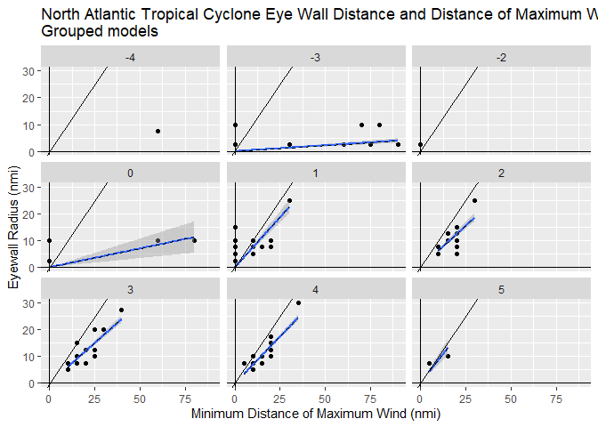
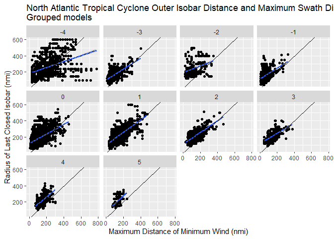
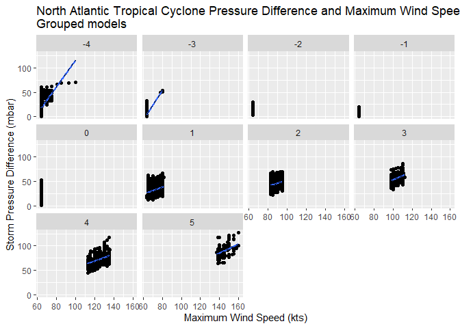
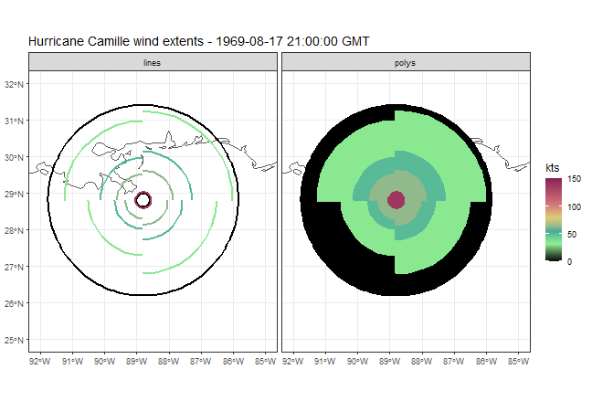
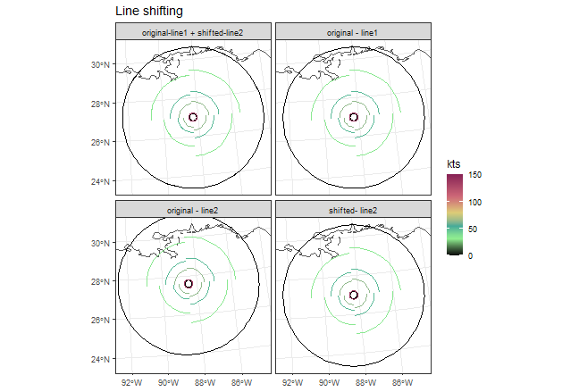
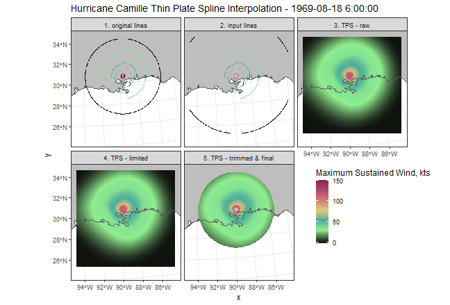
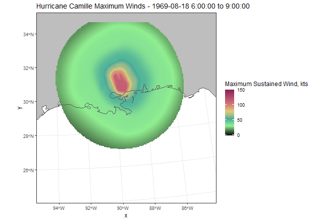

Cyclones Introduction
================
Ben Branoff
2026-01-20

R utilities for gathering data related to wind, precipitation, and storm surge from tropical cyclones. 
## General work flow

Use the 'get_storms' function to gather the available time series and wind information for a particular storm. If a local data source is available, it can be used, either as the file location or as a pre-loaded dataset. If not, the data will be downloaded from the web.

``` r
library(Cyclones)

##  storms can be singular or plural and can be identified specifically, or not
storms <- get_storms(source="hurdat",name="Maria",basin="NA",season=2017)
storms <- get_storms(source="hurdat",name=c("Maria","IRMA"),basin="NA",season=2017)

##  alternatively, all of the data can be downloaded and filtered later
storms <- get_storms() |>
              filter(NAME=="HELENE",SEASON==2024)
```

With the data loaded, it can now be used to build rasters of wind, precipitation, and/or storm surge. If the Thin Plate Spline (TPS) wind method is desired, we must first build the models for the lookup table. These should be based on as full or limited of a set of storms as necessary for the objective. For generalized modeling, its best to use a full set up storms.

``` r

###  downloading all storms will likely require extending the timeout time
# options(timeout = 300)
allstorms <- get_storms(ib_filt="ALL")

mods <- build_models(tracks=allstorms)


```

## Build Wind Models
<details>
<summary>
## Read in and parse previous cyclone data
</summary>

Start with the IBTrACS data (updated data available at:
<https://www.ncei.noaa.gov/data/international-best-track-archive-for-climate-stewardship-ibtracs/v04r01/access/csv/>)

``` r
library(dplyr)
library(tidyr)
library(ggplot2)
library(purrr)

###  Load in the North Atlantic data only:
IBTrACS <- read.csv(paste0(dirname(getwd()),"./data/ibtracs.NA.list.v04r01.csv"))
####  limit to storms in or after 2000 for brevity
IBTrACS <- IBTrACS %>%
  filter(SEASON>=2000)
```

Determine the extent of maximum winds and other wind extent observations
from the data

``` r
quaddist <- bind_rows(
  IBTrACS %>%  
    ####  these columns describe the extent of 34,50 and 64 knot winds in each of the storms quadrant
    ####  at different timesteps 
    select(USA_R34_NE,USA_R34_SE,USA_R34_NW,USA_R34_SW,  
           USA_R50_NE,USA_R50_SE,USA_R50_NW,USA_R50_SW,  
           USA_R64_NE,USA_R64_SE,USA_R34_NW,USA_R64_SW,
           ###  these are identifiers and more variables important for additional models
           SID,ISO_TIME,USA_SSHS,USA_EYE,USA_RMW,USA_WIND,USA_PRES,USA_ROCI,USA_POCI,USA_PRES,BASIN) %>%
    tidyr::pivot_longer(cols=c(USA_R34_NE,USA_R34_SE,USA_R34_NW,USA_R34_SW,  
                               USA_R50_NE,USA_R50_SE,USA_R50_NW,USA_R50_SW,  
                               USA_R64_NE,USA_R64_SE,USA_R34_NW,USA_R64_SW),  
                        names_to =c("speed","quad"),  
                        names_pattern = "USA_R(.*)_(.*)",values_to="dist") %>%  
    mutate(speed=as.numeric(speed),  
           source="swaths"),  
  IBTrACS %>%  
    select(SID,ISO_TIME,USA_SSHS,USA_EYE,USA_RMW,USA_WIND,USA_PRES,USA_ROCI,USA_POCI,USA_PRES,BASIN) %>%
    ###  there are also two columns that describe the maximum wind speed and its maximum distance in the storm
    ###  this is not provided for each quadrant and so is assumed to be circular and symmetric
    mutate(quad=list(c("NE","SE","SW","NW")),  
           speed=as.numeric(USA_WIND),  
           source="RMW")%>%  
    dplyr::select(-USA_WIND) %>%  
    tidyr::unnest(quad) %>%  
    rename(dist=USA_RMW)) %>%  
    mutate(across(c(dist, speed,USA_EYE,USA_ROCI,USA_POCI,USA_PRES), ~as.numeric(.)),
           USA_SSHS_lab=paste0("Cat. ",USA_SSHS))
```

</details>

## Fit models from previous hurricane data

We need these to reconstruct wind extents for any given storm with
limited information. Here are non-linear asymptotic models as well as
log-tansformed linear models of the wind speed distance as a function of
wind speed and storm size by quadrant:

``` r
###  Asymptotic models by storm size and quadrant
ggplot(quaddist%>%filter(!is.na(dist)),aes(x=speed,y=dist,col=factor(quad)))+
  geom_point(size=0.5)+
  geom_point(data=quaddist%>%group_by(quad,speed,USA_SSHS) %>%summarise(dist=mean(dist,na.rm=T)))+
  stat_smooth(method = "nls", formula = y ~ SSasymp(x, Asym, R0, lrc),se=FALSE)+
  facet_wrap(~USA_SSHS)+
  labs(col="Quadrant")+
  ggtitle("North Atlantic Tropical Cyclone Wind Speed Distance by Storm Saffir-Simpson Scale\nAsymptotic models")+
  xlab("Wind Speed (kts)")+ylab("Max. distance from center (nmi)")
```

<!-- -->

``` r
####  close up of Category 5 storms
ggplot(quaddist%>%filter(!is.na(dist),USA_SSHS==5),aes(x=speed,y=dist,col=factor(quad)))+
  geom_point(size=0.5)+
  geom_point(data=quaddist%>%group_by(quad,speed,USA_SSHS) %>%summarise(dist=mean(dist,na.rm=T)),size=1)+
  stat_smooth(method = "nls", formula = y ~ SSasymp(x, Asym, R0, lrc),se=FALSE)+
  facet_wrap(~USA_SSHS_lab)+
  labs(col="Quadrant")+
  ggtitle("North Atlantic Tropical Cyclone Wind Speed Distance by Storm Saffir-Simpson Scale\nAsymptotic models")+
  xlab("Wind Speed (kts)")+ylab("Max. distance from center (nmi)")
```

<!-- -->

``` r
###  a linear model of the wind speed distance as a function of wind speed and storm size
###  fit doesnt seem as good as the non-linear model
ggplot(quaddist,aes(x=log(speed),y=dist,col=quad))+
geom_point()+
  geom_point(data=quaddist%>%
               filter(!is.na(dist))%>%
               group_by(quad,USA_SSHS,speed) %>%
               summarise(dist=mean(dist,na.rm=T))) +
  stat_smooth(method="lm", formula=y~log(x),se=TRUE)+
  facet_wrap(~USA_SSHS)+
  labs(col="Quadrant")+
  ggtitle("North Atlantic Tropical Cyclone Wind Speed Distance by Storm Saffir-Simpson Scale\nLinear models")+
  xlab("Wind Speed (kts)")+ylab("Max. distance from center (nmi)")
```

<!-- --> In general, the
SW quadrant has higher winds closer to the center, and the NE quadrant
has the same wind speeds farther out. Storm size also seems to be
important. The linear model does not seem to fit as well as the
asymptotic models. In either case, models generally only compute for
true hurricanes/typhoons with Saffir-Simpson scale larger than 0. We
cant easily include an interaction term for an Asymp model, but that is
approached in further steps.

## Compare models

``` r
modquad <- lm(data=quaddist%>%filter(USA_SSHS>=1),dist~log(speed):quad)  
modquad_asymp <- nls(dist ~ SSasymp(speed, Asym,R0, lrc), data = quaddist%>% filter(USA_SSHS>=1),control = list(maxiter = 500))
summary(modquad_asymp)
```

    ## 
    ## Formula: dist ~ SSasymp(speed, Asym, R0, lrc)
    ## 
    ## Parameters:
    ##       Estimate Std. Error t value Pr(>|t|)    
    ## Asym  13.77095    0.42665   32.28   <2e-16 ***
    ## R0   777.11506   14.80396   52.49   <2e-16 ***
    ## lrc   -2.85674    0.01092 -261.68   <2e-16 ***
    ## ---
    ## Signif. codes:  0 '***' 0.001 '**' 0.01 '*' 0.05 '.' 0.1 ' ' 1
    ## 
    ## Residual standard error: 39.09 on 73335 degrees of freedom
    ## 
    ## Number of iterations to convergence: 5 
    ## Achieved convergence tolerance: 6.984e-07
    ##   (10212 observations deleted due to missingness)

``` r
summary(modquad)
```

    ## 
    ## Call:
    ## lm(formula = dist ~ log(speed):quad, data = quaddist %>% filter(USA_SSHS >= 
    ##     1))
    ## 
    ## Residuals:
    ##    Min     1Q Median     3Q    Max 
    ## -98.02 -27.84  -7.47  19.95 364.66 
    ## 
    ## Coefficients:
    ##                    Estimate Std. Error t value Pr(>|t|)    
    ## (Intercept)        463.4697     1.6356   283.4   <2e-16 ***
    ## log(speed):quadNE  -98.7214     0.4117  -239.8   <2e-16 ***
    ## log(speed):quadNW -100.2221     0.4181  -239.7   <2e-16 ***
    ## log(speed):quadSE  -99.9373     0.4117  -242.7   <2e-16 ***
    ## log(speed):quadSW -103.6325     0.4118  -251.7   <2e-16 ***
    ## ---
    ## Signif. codes:  0 '***' 0.001 '**' 0.01 '*' 0.05 '.' 0.1 ' ' 1
    ## 
    ## Residual standard error: 41.11 on 73333 degrees of freedom
    ##   (10212 observations deleted due to missingness)
    ## Multiple R-squared:  0.4646, Adjusted R-squared:  0.4646 
    ## F-statistic: 1.591e+04 on 4 and 73333 DF,  p-value: < 2.2e-16

``` r
AIC(modquad,modquad_asymp)
```

    ##               df      AIC
    ## modquad        6 753213.5
    ## modquad_asymp  4 745809.1

``` r
BIC(modquad,modquad_asymp)
```

    ##               df      BIC
    ## modquad        6 753268.7
    ## modquad_asymp  4 745846.0

By AIC and BIC, the asymptotic model is marginally better, not enough
for a true determination of fitness. Try new models grouped by storm
size (saffir simpson and or quad, rather than a single model with these
as covariables (in the linear model’s case).

``` r
##  create new dataset with all wind speeds present for each storm size and quadrant
quaddist_new <- quaddist %>%
  filter(USA_SSHS>=1)%>%
  distinct(USA_SSHS,quad)%>%
  group_by(USA_SSHS,quad) %>%
  reframe(speed=1:175)%>%
  nest_by(USA_SSHS,quad) 

##  build models on the original data, nested by both size and quadrant
modquads <- quaddist%>% filter(USA_SSHS>=1) %>%
  group_nest(USA_SSHS,quad) %>%
  mutate(data2=quaddist_new$data,  ###  predict fitted models onto the new dataset with the full range of windspeeds
         model_asymp = map(data,~nls(dist ~ SSasymp(speed, Asym,R0, lrc), data = .,control = list(maxiter = 500))),
         model_lm = map(data,~lm(dist ~log(speed), data = .)),
         pred_asymp=map2(model_asymp,data2,predict),
         pred_lm=map2(model_lm,data2,predict)) 
### take the predicted and original values to plot with
modquad_df <- modquads %>%
  select(-c(data,model_asymp,model_lm)) %>%
  tidyr::unnest(c(data2,pred_asymp,pred_lm)) %>%
  left_join(modquads%>% tidyr::unnest(data)%>%select(USA_SSHS,quad,speed,dist),by=c("USA_SSHS","quad","speed")) %>%
  distinct(USA_SSHS,quad,speed,dist,.keep_all=T)

ggplot(modquad_df %>% group_by(USA_SSHS,quad,speed) %>%
         summarise(dist=mean(dist,na.rm=T),
                   speed=mean(speed),
                   fit_lm=mean(pred_lm),
                   fit_asymp=mean(pred_asymp)),
       aes(x=speed,y=dist,col=factor(quad)))+
  geom_point()+
  facet_wrap(~USA_SSHS)+
  geom_line(aes(x=speed,y=fit_asymp,lty="asympt."))+
  geom_line(aes(x=speed,y=fit_lm,lty="linear"))+
  scale_linetype_manual(values=c(1,2))+
  labs(lty="model type",col="Quadrant")+
  ggtitle("North Atlantic Tropical Cyclone Wind Speed Distance by Storm Saffir-Simpson Scale\nGrouped models")+
  xlab("Wind Speed (kts)")+ylab("Max. distance from center (nmi)")
```

<!-- -->

``` r
##compare the models
bind_rows(map2(modquads$model_asymp,modquads$model_lm,~AIC(.x,.y)) %>%
                        bind_rows() %>%
                        rename(score=AIC) %>%
                        mutate(USA_SSHS=rep(modquads$USA_SSHS,each=2),
                               quad=rep(modquads$quad,each=2),
                               model=rep(c("asymp","lm"),20),
                               type="AIC"),
                      map2(modquads$model_asymp,modquads$model_lm,~BIC(.x,.y)) %>%
                        bind_rows() %>%
                        rename(score=BIC) %>%
                        mutate(USA_SSHS=rep(modquads$USA_SSHS,each=2),
                               quad=rep(modquads$quad,each=2),
                               model=rep(c("asymp","lm"),20),
                               type="BIC"))%>%
  group_by(USA_SSHS,quad) %>%
  mutate(bestAIC=model[score==min(score[type=="AIC"])],
         bestBIC=model[score==min(score[type=="BIC"])])
```

    ## # A tibble: 80 × 8
    ## # Groups:   USA_SSHS, quad [20]
    ##       df  score USA_SSHS quad  model type  bestAIC bestBIC
    ##    <dbl>  <dbl>    <int> <chr> <chr> <chr> <chr>   <chr>  
    ##  1     4 98266.        1 NE    asymp AIC   asymp   asymp  
    ##  2     3 98646.        1 NE    lm    AIC   asymp   asymp  
    ##  3     4 74989.        1 NW    asymp AIC   asymp   asymp  
    ##  4     3 75260.        1 NW    lm    AIC   asymp   asymp  
    ##  5     4 97412.        1 SE    asymp AIC   asymp   asymp  
    ##  6     3 97743.        1 SE    lm    AIC   asymp   asymp  
    ##  7     4 96399.        1 SW    asymp AIC   asymp   asymp  
    ##  8     3 96734.        1 SW    lm    AIC   asymp   asymp  
    ##  9     4 40736.        2 NE    asymp AIC   asymp   asymp  
    ## 10     3 41063.        2 NE    lm    AIC   asymp   asymp  
    ## # ℹ 70 more rows

The asymptotic model is a better fit for most combinations of quadrant
and saffir simpson scale. More importantly, the asymptotic model never
drops below zero, which is important for predicting high winds near the
eye of the storm.

Also need to model the eyewall radius. For these, its important to set
the intercept to 0. We know that the eyewall radius can’t be negative
and it cant be more than the extent of maximum winds, and setting the
intercept to 0 assures that.

``` r
eyemod <- quaddist %>% 
  group_by(SID,ISO_TIME) %>%
  filter(dist==min(dist,na.rm=T),USA_EYE!=" ")%>%
  mutate(USA_EYE=as.numeric(USA_EYE)/2) %>%
  ungroup() %>%
  group_nest(USA_SSHS) %>%
  mutate(model=map(data,~lm(USA_EYE~0 + dist,data=.)),
         pred=map(model, predict)) 


ggplot(data=eyemod %>% tidyr::unnest(c(data,pred)),
       aes(x=dist,y=USA_EYE))+
  geom_point()+
  facet_wrap(~USA_SSHS)+
  stat_smooth(method="lm",formula="y~x+0")+
  geom_line(aes(y=pred),lty=2)+
  geom_abline(slope=1,intercept=0)+
  geom_vline(xintercept=0)+
  geom_hline(yintercept=0)+
  ggtitle("North Atlantic Tropical Cyclone Eye Wall Distance and Distance of Maximum Wind by Storm Saffir-Simpson Scale\nGrouped models")+
  xlab("Minimum Distance of Maximum Wind (nmi)")+ylab("Eyewall Radius (nmi)")
```

<!-- -->

These models look decent for “large” storms (2-5) but begin to weaken
considerably for “small” storms (0 & 1). We should use them cautiously
and scrutinize any predictions made.

Finally, we need models for the overall storm size or its outer radius.
This is important for constraining the interpolations made later. The
storm size is coded in IBTrACS as the radius of last closed isobar, or
ROCI. Its pressure is codes as the pressure at the last closed isobar,
or POCI.

``` r
ROCImod <- quaddist %>% 
  group_by(SID,ISO_TIME) %>%
  filter(dist==max(dist,na.rm=T),!is.na(USA_ROCI)) %>%
  ungroup() %>%
  group_nest(USA_SSHS) %>%
  mutate(model=map(data,~lm(USA_ROCI~dist,data=.)),
         pred=map(model, predict))
ggplot(data=ROCImod %>% tidyr::unnest(c(data,pred)),
       aes(x=dist,y=USA_ROCI))+
  geom_point()+
  facet_wrap(~USA_SSHS)+
  stat_smooth(method="lm",formula="y~x")+
  geom_line(aes(y=pred),lty=2)+
  geom_abline(slope=1,intercept=0)+
  ggtitle("North Atlantic Tropical Cyclone Outer Isobar Distance and Maximum Swath Distance\nGrouped models")+
  xlab("Maximum Distance of Minimum Wind (nmi)")+ylab("Radius of Last Closed Isobar (nmi)")
```

<!-- -->

For larger storms, the outer radius/diameter can be reasonably predicted
from the largest known wind swath. We also need the minimum pressure of
the system. This is important for predicting the pressure at any point
in the storm, which is imortant for approximating the density of air,
which gets us to the force or that air blowing at a particulat speed,
which finally gives us the energy dissipated by that mass of air on a
surface.

``` r
POCImod <- quaddist %>% 
  filter(!is.na(USA_POCI),!is.na(USA_PRES),(USA_POCI-USA_PRES)>0) %>%
  group_by(SID,ISO_TIME) %>% 
  mutate(USA_WIND=max(speed),
         Pressdif = USA_POCI-USA_PRES) %>%
  ungroup()%>%
  group_nest(USA_SSHS) %>%
  mutate(model=map(data,~lm(Pressdif~USA_WIND,data=.)),
         pred=map(model, predict))
```

``` r
ggplot(POCImod %>% tidyr::unnest(c(data,pred)),
       aes(x=USA_WIND,y=Pressdif))+
  geom_point()+
  facet_wrap(~USA_SSHS)+
  stat_smooth(method="lm",formula=y~x)+
  geom_line(aes(y=pred),lty=2)+
  ggtitle("North Atlantic Tropical Cyclone Pressure Difference and Maximum Wind Speed\nGrouped models")+
  xlab("Maximum Wind Speed (kts)")+ylab("Storm Pressure Difference (mbar)")
```

<!-- -->

With these models, we can reconstruct a cyclone’s wind and pressure
fields from limited information. This allows us to predict velocity,
pressure, and power dissipation at any point in a storm based on
observations from previous storms. In most cases, these models are only
reasonable for true hurricanes/typhoons with a Saffir-Simpson rating
greater than 0. Save the models to use in later steps.

    saveRDS(modquads%>% select(-c(data,pred)),"modquads.rds")
    saveRDS(eyemod%>% select(-c(data,pred)),"eyemod.rds")
    saveRDS(ROCImod%>% select(-c(data,pred)),"ROCI.rds")
    saveRDS(POCImod%>% select(-c(data,pred)),"POCImod.rds")
    minpress <- quaddist %>% mutate(MONTH=format.Date(ISO_TIME,"%m")) %>%group_by(BASIN,USA_SSHS,MONTH) %>%summarise(USA_PRES=mean(USA_PRES,na.rm=TRUE))
    write.csv(minpress,"minpress.csv",row.names=FALSE)
    ###  note, when reading this data set back in, make sure the NA basin for North America is not set to missing (NA)
    ##  minpress <- minpress %>% mutate(BASIN=if_else(is.na(BASIN),"NA",BASIN))
    
## Reconstruct wind and pressure fields for individual storms

With the models from the above steps, we can now predict the extent of different wind speeds, including the maximum winds, as well as the radius of the eye wall, and the maximum extent of a storm, for any previous storm that does not include this information. 

Hurricane Camille made landfall in the Gulf Coast state of Mississippi in August of 1969. It was a devastating storm in many ways, but the IBTRACs data does not include information on the extent of any of the wind speeds. It includes only the maximum wind speed and one observation with the extent. To properly assess the intensity of the storm at any point along its path, we need to first predict where the different wind speeds (34, 50, and 64 knots) occurred. Here, we predict where the different winds occurred based on the minimum pressure and the maximum wind speed, and then project the location of the various wind speeds (34, 50, and 64 knots) onto arcs described by the predicted radius and quadrant. We do this iteratively for each time step. 
``` r
###  we will need some additional libraries
###  if we want to use parallel processing, we will need to load the snowfall package as well
library(sf)
library(dplyr)
library(purrr)
library(tibble)
#library(snowfall)

###  grab the tabular data for Camille
CAMILLE <- read.csv("ibtracs.ALL.list.v04r01.csv") %>%
  filter(SEASON==1969,NAME=="CAMILLE")%>%
  ##  make sure the timestamp is appropriately formatted
  mutate(ISO_TIME = as.POSIXct(ISO_TIME,tz="GMT"),
  MONTH=format.Date(ISO_TIME,"%m"),
  BASIN=if_else(is.na(BASIN),"NA",BASIN))
  
##source the functions
source("Swath Maker helpers.R")

##  use the 'make_swaths' function interatively over each timestep to reconstruct the spatial extent of all wind speeds
linesswaths <- lapply(1:nrow(IBTrACS),make_swaths,mod=modquads,emod=eyemod,rocimod=ROCImod,pocimod=POCImod,tracks=CAMILLE,minpresss=minpress)
lineswaths = lapply(1:nrow(IBTRACKS%>%filter(NAME=="FRANK",SEASON==2004,SID=="2004026S12063")),function(i) make_extent(mods,IBTRACKS%>%filter(NAME=="FRANK",SEASON==2004,SID=="2004026S12063")%>%slice(i)))

##  the parallel version. Only use if confident in machine's ability to do so
##  choose an appropriate number of cpus (roughly %50-75 of available cpus)
#sfInit(parallel=TRUE, cpus=15)
#load the appropiate libraries
#sfLibrary(sf)
#sfLibrary(dplyr)
#sfLibrary(purrr)
#sfLibrary(tibble)
#sfExport('rot')
#linesswaths <- sfLapply(1:nrow(IBTrACS),make_swaths,mod=modquads,emod=eyemod,rocimod=ROCImod,pocimod=POCImod,tracks=IBTrACS,minpresss=minpress)
#sfStop()

##  The function returns results in two forms, linestrings and polygons
##  separate into their respective parts
swaths <- do.call(rbind,lapply(linesswaths,'[[',1))
linestrings <-  do.call(rbind,lapply(linesswaths,'[[',2))


###  visualize the result
bind_rows(swaths %>% mutate(geomtype="polys"),linestrings %>%mutate(geomtype="lines"))%>%
arrange(kts)%>%
ggplot()+
geom_sf(data=rnaturalearth::ne_countries(country=c("united states of america","mexico","canada"),scale="medium"),fill=NA)+
geom_sf(aes(col=kts,fill=kts))+
scale_color_gradientn(
    colours = c("black","lightgreen","#44AA99","#DDCC77","#CC6677","#882255"),
    values = scales::rescale(c(64, 83, 96, 113,137)), # breakpoints in data space
    limits = c(0, 150))+
scale_fill_gradientn(
    colours = c("black","lightgreen","#44AA99","#DDCC77","#CC6677","#882255"),
    values = scales::rescale(c(64, 83, 96, 113,137)), # breakpoints in data space
limits = c(0, 150))+
facet_wrap(~geomtype)+
ggtitle("Hurricane Camille wind extents")+
theme_bw()+
xlim(100,80)+ylim(20,45)

```
The maps show the lines and polygons versions of the resulting wind extents. Notice how the extents are quadrant specific. Again, none of these wind extents were provided in the original tabular data, they have been predicted from the models constructed above, mostly based on the provided minimum pressure at each time step. The lower graph singles out one of the time steps around when the storm made landfall in Louisiana on August 17th, 1969. 

<!-- -->
<!-- -->
    
These datasets are now similar to what the National Hurricane Center produces for most modern storms, but not for any storms before 2009. Thus, to provide a consistent set of spatial wind extents for any storm before around 2010, we need to use the tabular information provided by IBTrACS and convert it to spatial information as demonstrated above. 

## Interpolate wind and pressure fields

The above steps only provides us with the extent of different wind speeds in 3-hour increments. We need more fine-grained detailed information on what happens between the different wind extents and between the three hour time steps. To achieve this, we combine linear interpolation with a thin plate spline interpolation and arrive at a much smoother representation of wind fields within the storm.

First read in the same tabular date from IBTrACS and convert the individual center points to lines representing the 3 hour track segments of each storm

``` r
###  make into lines from points
###  read in the tabular data
IBTrACS <- read.csv("ibtracs.ALL.list.v04r01.csv") %>%
  filter(SEASON==1969,NAME=="CAMILLE")%>%
  ##  make sure the timestamp is appropriately formatted
  mutate(ISO_TIME = as.POSIXct(ISO_TIME,tz="GMT"),
  BASIN=if_else(is.na(BASIN),"NA",BASIN)) %>%
  ###  turn into point geometry
  st_as_sf(coords=c("LON","LAT"),crs=4326,remove=FALSE) %>%
  ###  the lines are two sets of points, so we need to set the leading point and the lagging point
  mutate(
    geometry_lead = lead(geometry, default = NULL)
  ) %>%
  # drop the NA row created by lagging
  slice(-n()) %>% 
  ###  now combine the two sets of points
  mutate(line = st_sfc(purrr::map2(
      .x = geometry, 
      .y = geometry_lead, 
      .f = ~{st_union(c(.x, .y)) %>% st_cast("LINESTRING")}
    ))) %>%
  st_drop_geometry()%>%
  select(-geometry_lead) %>%
  rename(geometry="line") %>%
  st_set_geometry("geometry") %>%
  st_set_crs(st_crs(4326)) %>% arrange(ISO_TIME)

##  Now get the lines produced earlier and representing the wind extents 
lne <- linestrings %>%
  ## make sure the dates coincide
  filter(date>=min(IBTrACS$ISO_TIME,na.rm=T),date<=max(IBTrACS$ISO_TIME)) %>%
  arrange(date,kts) %>% 
  group_by(date) %>%
  mutate(l = seq(1,n())) %>%
  ungroup() %>%
  ##  get the time difference between the start and end of the line segment
  mutate(dt=as.numeric(difftime(as.POSIXct(date),as.POSIXct(diag(sapply(l, function(n) dplyr::lag(date, n=n))))))) %>%
  st_transform("+proj=lcc +lat_0=40 +lon_0=-96 +lat_1=20 +lat_2=60 +x_0=0 +y_0=0 +datum=NAD83 +units=m +no_defs +type=crs")
  
###  interpolate points along a given track segment
###  track segments are generally 3 hours in duration
###  this is too coarse for the raster interpolation
###  this function provides new points along the line in 3 minute intervals
###  it assumes the storm is moving at the same speed during the 3 hour segment
trck_points <- track_interp(IBTrACS) %>%
    st_transform(st_crs(lne))
###  get the date stamps of the original track
###  we will iterate over these
dts = unique(lne$date)[1:(length(unique(lne$date))-1)]

###  Now the 'meat' of the process is to iterate over each line segment, create end-point rasters of wind speed for the beginning and end of the segment 
###  using Thin Plate Spline to interpolate between the lines we produced earlier. 
###  Then linearly interpolate between those end points to get the 3 min interval windspeeds
###  The TPS interpolation is resource hungry and may be limited on insufficent machines. There are alternatives but those arent discussed here.

###  the non-parallel version, much slower, is
fields <- lapply(dts,FUN=fields_wrapper,dates=dts,line=lne,track_points=trck_points,oldw=getOption("warn"),track=IBTrACS,parll=F)

### the parallel version
#library(snowfall)
#sfInit(parallel=TRUE, cpus=10)#, slaveOutfile=logtmp)
#sfLibrary(sf)
#sfLibrary(terra)
#sfLibrary(dplyr)
#sfLibrary(fields)
#sfLibrary("snowfall", character.only=TRUE)
#sfExport('move_and_interp_snowfall')
#sfExport('line_int_snowfall')
#sfExport('comparewinds')
#sfExport('get_dir')
#fields <- sfLapply(dts,fun=fields_wrapper,dates=dts,line=lne,track_points=trck_points,oldw=getOption("warn"),track=IBTrACS,parll=T)
#sfStop()
```
Walking through the individual steps behind the fields_wrapper function shows how the final results are constructed. Here, we pick the same time as above, when the storm was at its most intense and close to making landfall. This will show the full range of the interpolation. The function will take the two sets of wind extent lines corresponding to the present time stamp as well as the next one. It then creates a custom coordinate reference system centered on those lines. This helps ensure proper distance calculations and minimizes distortion. It then shifts the second set of lines to be centered on the first. This allows for linear interpelation once the two end points are calculated.

```r
d1 = as.POSIXct("1969-08-18 6:00:00", tz="GMT")
d2 = as.POSIXct("1969-08-18 9:00:00", tz="GMT")
line1 <- lne %>% filter(date==d1)
line2 <- lne %>% filter(date==d2)
###  create custom crs centered on current track segment
##  this reduces geometry calculation errors from using a general global crs
custCRS <- paste0("+proj=laea +x_0=0 +y_0=0 +lon_0=",
                  st_coordinates(trck_points[trck_points$ISO_TIME==d2,] %>%st_transform(4326))[,"X"],
                  " +lat_0=",
                  st_coordinates(trck_points[trck_points$ISO_TIME==d2,]%>%st_transform(4326))[,"Y"])
###  calculate the delta x and delta y between the two locations
###  we will use this to align the two dates on top of eachother so we can then interpolate between them
coord_dif <- st_coordinates(trck_points[trck_points$ISO_TIME==d2,] %>% st_transform(custCRS))-
  st_coordinates(trck_points[trck_points$ISO_TIME==d1,]%>% st_transform(custCRS))
## get all of the dates and calculate the time difference between each
##  this is important for calculating energy dissipation, which is a function of the time
dates <- trck_points$ISO_TIME[trck_points$ISO_TIME<=d2&trck_points$ISO_TIME>=d1]
dt <- unique(difftime(dates, lag(dates),unit="hours"))
dt <- as.numeric(dt[!is.na(dt)])
###  now shift the second line segment to be centered on the first
##  this will allow us to interpolate raster representations between the two times
line2.2 <- st_as_sfc(line2 %>% st_transform(custCRS))-matrix(data=coord_dif,ncol=2)
line2.2 <- st_sf(geom=line2.2)
st_crs(line2.2) <- custCRS
line2.2 <- line2.2 %>% st_transform(st_crs(line1))  %>%
  st_as_sf() %>%
  rename(geometry=geom)
line2.2<- cbind(line2.2,st_drop_geometry(line2))

bind_rows(line1 %>% mutate(source="original - line1"),line2 %>% mutate(source="original - line2"),line2.2 %>% mutate(source="shifted- line2"),
rbind(line1,line2.2) %>% mutate(source="original-line1 + shifted-line2"))%>%
arrange(kts)%>%
ggplot()+
geom_sf(data=rnaturalearth::ne_countries(country=c("united states of america","mexico","canada"),scale="medium"),fill=NA)+
geom_sf(aes(col=kts,fill=kts))+
scale_color_gradientn(
    colours = c("black","lightgreen","#44AA99","#DDCC77","#CC6677","#882255"),
    values = scales::rescale(c(64, 83, 96, 113,137)), # breakpoints in data space
    limits = c(0, 150))+
scale_fill_gradientn(
    colours = c("black","lightgreen","#44AA99","#DDCC77","#CC6677","#882255"),
    values = scales::rescale(c(64, 83, 96, 113,137)), # breakpoints in data space
limits = c(0, 150))+
facet_wrap(~source)+
ggtitle("Line shifting")+
theme_bw()+
xlim(107650,1128130)+ylim(-1629130,-548305)


```
<!-- -->

In the above graph, you can see the shift of line 2, corresponding to the later date. In this case, the storm has made landfall and begun to weaken. Its maximum sustained wind falls from 150 to 115 knots, and this is visible in the overlapping sets of lines in the top left panel via the shrinking radius of the wind extents.    

Now, to interpolate at the end points, the function uses a Thin Plate Spline algorithm with the wind extent lines as the input. It does this to the two superimposed (one shifted) set of lines and then uses linear interpolation to calculate the 3 min intervals between the endpoints. When running the TPS, the extreme change around the eye wall (from maximum winds to near 0), as well as the outer extent of the storm (ROCI) can create unnatural spikes. So, we remove those inputs to the TPS and zero them out by cropping in a later step.

```r
## first, get the extent of the lines and create an empty raster
## this extent is the largest extent of the storm, as determined by the radius of the last closed isobar (ROCI), which was calculated when the lines were constructed
ex = trck_points %>% st_buffer(max(lne$dist_m_mean)) %>%ext()
r = rast(ext=ex, resolution=5000, 
            crs="+proj=lcc +lat_0=40 +lon_0=-96 +lat_1=20 +lat_2=60 +x_0=0 +y_0=0 +datum=NAD83 +units=m +no_defs +type=crs")
###
###   Using the original ROCI and eye wall can create extreme and unnatural shifts in wind Velocity with the thin spline method
###   to avoid this, bump the 0 velocity line of the ROCI out a bit further
###   we will still zero out the original ROCI later, this is only for the thine spline interpolation
line <- bind_rows(line2.2,
                  line2.2%>%filter(quad=="ROCI")%>%st_cast("POLYGON")%>%st_buffer(.$dist_m_mean*.5) %>%
                      mutate(quad="ROCI2")%>%st_cast("LINESTRING"))
r <- crop(r,line%>%filter(quad=="ROCI2"))
####  remove the eye and the outer storm limits 
###  we can set those to zero later
###  rasterize the remaining swaths, one for velocity and one for pressure
rv <-  rasterize(line%>%filter(!line$quad %in%c("ROCI","eye")), r, "kts",touches=T,fun="max")
###  convert the xyz values to a dataframe for thin spline interpolation
xyv <- as.data.frame(rv, xy=T,na.rm=F)
tps_v <- fields::Tps(xyv[,1:2], xyv[,3])
###  use the model to predict the unknown wind speeds
p_v <- interpolate(r, tps_v)
###  for the  purpose of displaying within this vignette, save each raster step
###  this is not done in the function
p_v_raw <- p_v
###  in case the model predicts higher than recorded wind speeds, set them to the maximum known
p_v[p_v>max(line$kts,na.rm=T)] <- max(line$kts,na.rm=T)
p_v[p_v<0] <- 0
p_v_2 <- p_v
###  now set the outer limits of the storm to 0
p_v <- mask(p_v,line %>% filter(quad=="ROCI") %>% st_cast("POLYGON"))
###  and if there is an eye, set it to 0 as well
if ("eye" %in% unique(line$quad)){
  p_v <- mask(p_v,line %>% filter(quad=="eye")%>%st_cast("POLYGON"),inverse=T)
  names(p_v) <- "lyr.1"
}
p_v_end <- p_v
###  again, just for the purpose of this vignette, stack the different step raster for display
p_v_list <- list(rasterize(line%>%filter(quad!="ROCI2"), r, "kts",touches=T,fun="max"),rv,p_v_raw,p_v_2,p_v_end)
names(p_v_list) <- c("1. original lines","2. input lines","3. TPS - raw","4. TPS - limited","5. TPS - trimmed & final")
plot(rast(p_v_list))
plot(rnaturalearth::ne_countries(country=c("united states of america"),scale="medium")%>%st_transform(crs(r)),add=TRUE)

ggplot(as.data.frame(rast(p_v_list),xy=TRUE)%>%tidyr::pivot_longer(cols=c(3:7),names_to="Layer"))+
geom_sf(data=rnaturalearth::ne_countries(country=c("united states of america"),scale="medium")%>%st_transform(crs(r)),fill="grey")+
geom_raster(aes(x=x,y=y,fill=value))+
facet_wrap(~Layer)+
scale_fill_gradientn(
    colours = c("black","lightgreen","#44AA99","#DDCC77","#CC6677","#882255"),
    values = scales::rescale(c(64, 83, 96, 113,137)), # breakpoints in data space
    limits = c(-2, 150),
    na.value = "transparent",
    name="Maximum Sustained Wind, kts")+
geom_sf(data=rnaturalearth::ne_countries(country=c("united states of america"),scale="medium")%>%st_transform(crs(r)),fill=NA)+
theme_bw()+
ggtitle("Hurricane Camille Thin Plate Spline Interpolation - 1969-08-18 6:00:00")+
theme(legend.position = c(0.9, 0.3))+
xlim(107650,1128130)+ylim(-1629130,-548305)

```
<!-- -->

The above process is carried out for each of the original 3 hour time steps in which wind extent features were produced. However, remember that before doing this, one of a pair of two end points is shifted as described above such that it overlaps its companion endpoint. Thus,each pixel in the two endpoint rasters are then perfectly aligned. In the following steps, we then create empty rasters corresponding to each of the 3 min time steps between the two endpoints and we linearly interpolate their values.

```r
###  if rs1 and rs2 are the final rasters as produced in the previous step, each belonging to a pair of timestep end points.
###  extend them so they have the same extents
rs1 <- extend(rs1,rs2) ##  here rs1 is the TSP wind field for the time step 1969-08-18 6:00:00
rs2 <- extend(rs2,rs1) ##  here rs2 is the TSP wind field for the time step 1969-08-18 9:00:00
##  create an empty list for the 3 min time step rasters between the endpoints
vlist <- list()
##  set the first layer as the first end point raster
##  then create new empty rasters for each of the 3 min time steps in between 
vlist[[1]] <- rs1
for (i in 2:(length(dates)-1)){
    vlist[[i]] <- setValues(rs1,NA)
}
##  now add in the end raster with known values from the second line segment
vlist[[length(vlist)+1]] <- rs2
###  load them to be processed as a raster
vs <- rast(vlist)
###  inerpolate (linearly) the missing values between the two end "points"
##  we assume here that velocity and power transitions are linear from one time point to the next
##  in this case, its a time difference of usually three hours
vs <- approximate(vs)
###  these rasters now hold the interpolated velocity and power values for times between the two end points
##  but their geographical information is shifted and identical
##  they now need to be moved to their respective geographic locations
###  create a new empty list to hold the shifted rasters
Vlist <- list()
##  Again, set the first raster to that of the the first set of line segments, which has the correct geographic representation
##  the second segment will not be included because it is included on the next iteration as the first segment
##  it was only used here as an endpoint for the approximation
Vlist[[1]] <- vs[[1]]
##  for the remaining rasters, shift them in space so they are centered on the points corresponding to their
##  respective timestamps
for (i in 2:(length(dates)-1)){
  d1 <- dates[1]
  d2 <- dates[i]
  ###  calculate the dx and dy between the two center points
  coord_dif <- st_coordinates(trck_points[trck_points$ISO_TIME==d2,])-
    st_coordinates(trck_points[trck_points$ISO_TIME==d1,])
  ##  shift the rasters accordingly
  v <- shift(vs[[i]],coord_dif[1], coord_dif[2])
  ## add the shifted rasters to the list
  Vlist[[length(Vlist)+1]] <- v
}

###  set the geometry back to the original rasters, to ensure all are equal before further processing
Vlist <- lapply(Vlist, function(x) resample(x,rs1))
a <- allNA(rast(Vlist))
Vlist <- ifel(is.na(rast(Vlist)), ifel(a, NA, 0), rast(Vlist))
##  This is now a list of 60 rasters, each representing a 3 min interval between the two endpoints, which are 3 hours apart
##  For wind speeds, we are mostly interested in the maximum wind that ocurred over an area for the duration of the storm
##  so, we take the maximum pixel value throughout the 60 layers
rV <- app(Vlist,fun=max,na.rm=T)
ggplot(as.data.frame(rV,xy=TRUE))+
geom_sf(data=rnaturalearth::ne_countries(country=c("united states of america"),scale="medium")%>%st_transform(crs(r)),fill="grey")+
geom_raster(aes(x=x,y=y,fill=max))+
scale_fill_gradientn(
    colours = c("black","lightgreen","#44AA99","#DDCC77","#CC6677","#882255"),
    values = scales::rescale(c(64, 83, 96, 113,137)), # breakpoints in data space
    limits = c(-2, 150),
    na.value = "transparent",
    name="Maximum Sustained Wind, kts")+
geom_sf(data=rnaturalearth::ne_countries(country=c("united states of america"),scale="medium")%>%st_transform(crs(r)),fill=NA)+
theme_bw()+
ggtitle("Hurricane Camille Maximum Winds - 1969-08-18 6:00:00 to 9:00:00")+
xlim(107650,1128130)+ylim(-1629130,-548305)

```
<!-- -->

```{r setup, include F}
####  for the total storm track
ggplot(as.data.frame(rV,xy=TRUE))+
geom_sf(data=rnaturalearth::ne_countries(country=c("united states of america","canada","greenland"),scale="medium")%>%st_transform(crs(r)),fill="grey")+
geom_raster(aes(x=x,y=y,fill=max))+
scale_fill_gradientn(
    colours = c("black","lightgreen","#44AA99","#DDCC77","#CC6677","#882255"),
    values = scales::rescale(c(64, 83, 96, 113,137)), # breakpoints in data space
    limits = c(-2, 150),
    na.value = "transparent",
    name="Maximum Sustained Wind, kts")+
geom_sf(data=rnaturalearth::ne_countries(country=c("united states of america","canada"),scale="medium")%>%st_transform(crs(r)),fill=NA)+
theme_bw()+
ggtitle("Hurricane Camille Maximum Winds")+
xlim(107650,3528130)+ylim(-2529130,1000000)
```

The above results in a series of raster images, as well as a dataframe that compares the resulting raster winds with values from the original lines (as a quality check). The rasters are wrapped, because rasters are kept on disc, not in memory, which does not allow for parallel processing. Wrapping them gets around this. The rasters represent the wind, power, and wind direction at each time stamp that was passed to the function as well as the 3 min interpolated time steps. These are raster stacks, which each layer in each stack representing a different time stamp. 

```r
####  create a blank raster with a specific resolution you want to resample to, in this case 5 km
r <- rast(ext=trck_points %>%
              st_buffer(max(lne$dist_m_mean[lne$quad=="ROCI"],na.rm=T)) %>%
              summarise() %>% ext(), resolution=5000, 
            crs="+proj=lcc +lat_0=40 +lon_0=-96 +lat_1=20 +lat_2=60 +x_0=0 +y_0=0 +datum=NAD83 +units=m +no_defs +type=crs")

###  extract the velocity layer from the listed results
rstackV <- lapply(fields,'[[',1)
### unwrap individual timesteps and stack them
rstackV <- rast(lapply(rstackV , function(x) if (!is.null(x)){resample(unwrap(x),r)}))
rV <- app(rstackV,fun=max,na.rm=T)


```

Its hard to visualize raster stacks, but we can easily aggregate the stacks to show a summary. For example, the maximum of the velocity layer would be the maximum wind velocity experienced by each pixel throughout the storm's lifetime. 


