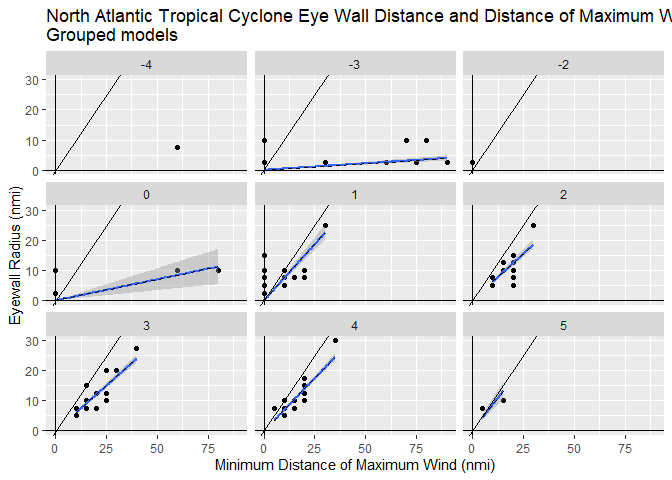
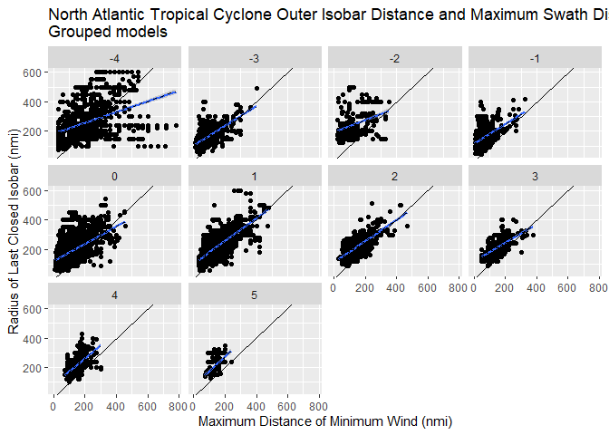
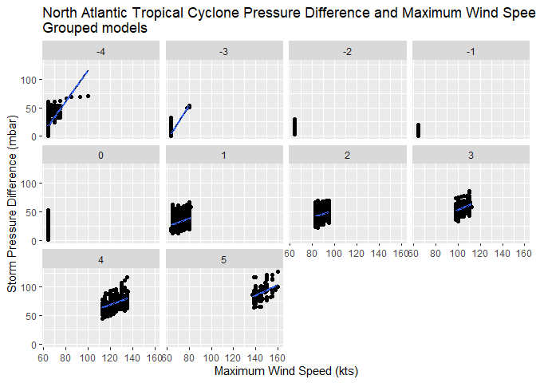

Cyclones Introduction
================
Ben Branoff
2025-03-18

R utilities for modeling and analyzing meteorological cyclones. Fit
models to observations of storm characteristics and use these models to
predict and interpolate wind and pressure fields across a storm’s area.

## Build Wind Models

## Read in and parse previous cyclone data

Start with the IBTrACS data (updated data available at:
<https://www.ncei.noaa.gov/data/international-best-track-archive-for-climate-stewardship-ibtracs/v04r01/access/csv/>)

``` r
library(dplyr)
library(tidyr)
library(ggplot2)
library(purrr)

###  Load in the North Atlantic data only:
IBTrACS <- read.csv(paste0(dirname(getwd()),"./data/ibtracs.NA.list.v04r01.csv"))
####  limit to storms in or after 2020 for brevity
IBTrACS <- IBTrACS %>%
  filter(SEASON>=2000)
```

Determine the extent of maximum winds and other wind extent observations
from the data

``` r
quaddist <- bind_rows(
  IBTrACS %>%  
    ####  these columns describe the extent of 34,50 and 64 knot winds in each of the storms quadrant
    ####  at different timesteps 
    select(USA_R34_NE,USA_R34_SE,USA_R34_NW,USA_R34_SW,  
           USA_R50_NE,USA_R50_SE,USA_R50_NW,USA_R50_SW,  
           USA_R64_NE,USA_R64_SE,USA_R34_NW,USA_R64_SW,
           ###  these are identifiers and more variables important for additional models
           SID,ISO_TIME,USA_SSHS,USA_EYE,USA_RMW,USA_WIND,USA_PRES,USA_ROCI,USA_POCI,USA_PRES) %>%
    tidyr::pivot_longer(cols=c(USA_R34_NE,USA_R34_SE,USA_R34_NW,USA_R34_SW,  
                               USA_R50_NE,USA_R50_SE,USA_R50_NW,USA_R50_SW,  
                               USA_R64_NE,USA_R64_SE,USA_R34_NW,USA_R64_SW),  
                        names_to =c("speed","quad"),  
                        names_pattern = "USA_R(.*)_(.*)",values_to="dist") %>%  
    mutate(speed=as.numeric(speed),  
           source="swaths"),  
  IBTrACS %>%  
    select(SID,ISO_TIME,USA_SSHS,USA_EYE,USA_RMW,USA_WIND,USA_PRES,USA_ROCI,USA_POCI,USA_PRES) %>%
    ###  there are also two columns that describe the maximum wind speed and its maximum distance in the storm
    ###  this is not provided for each quadrant and so is assumed to be circular and symmetric
    mutate(quad=list(c("NE","SE","SW","NW")),  
           speed=as.numeric(USA_WIND),  
           source="RMW")%>%  
    dplyr::select(-USA_WIND) %>%  
    tidyr::unnest(quad) %>%  
    rename(dist=USA_RMW)) %>%  
    mutate(across(c(dist, speed,USA_EYE,USA_ROCI,USA_POCI,USA_PRES), ~as.numeric(.)))
```

## Fit models from previous hurricane data

We need these to reconstruct wind extents for any given storm with
limited information. Here are non-linear asymptotic models as well as
log-tansformed linear models of the wind speed distance as a function of
wind speed and storm size by quadrant:

``` r
###  Asymptotic models by storm size and quadrant
ggplot(quaddist%>%filter(!is.na(dist)),aes(x=speed,y=dist,col=factor(quad)))+
  geom_point(size=0.5)+
  geom_point(data=quaddist%>%group_by(quad,speed,USA_SSHS) %>%summarise(dist=mean(dist,na.rm=T)))+
  stat_smooth(method = "nls", formula = y ~ SSasymp(x, Asym, R0, lrc),se=FALSE)+
  facet_wrap(~USA_SSHS)+
  labs(col="Quadrant")+
  ggtitle("North Atlantic Tropical Cyclone Wind Speed Distance by Storm Saffir-Simpson Scale\nAsymptotic models")+
  xlab("Wind Speed (kts)")+ylab("Max. distance from center (nmi)")
```

<!-- -->

``` r
###  a linear model of the wind speed distance as a function of wind speed and storm size
###  fit doesnt seem as good as the non-linear model
ggplot(quaddist,aes(x=log(speed),y=dist,col=quad))+
geom_point()+
  geom_point(data=quaddist%>%
               filter(!is.na(dist))%>%
               group_by(quad,USA_SSHS,speed) %>%
               summarise(dist=mean(dist,na.rm=T))) +
  stat_smooth(method="lm", formula=y~log(x),se=TRUE)+
  facet_wrap(~USA_SSHS)+
  labs(col="Quadrant")+
  ggtitle("North Atlantic Tropical Cyclone Wind Speed Distance by Storm Saffir-Simpson Scale\nLinear models")+
  xlab("Wind Speed (kts)")+ylab("Max. distance from center (nmi)")
```

<!-- --> In general, the
SW quadrant has higher winds closer to the center, and the NE quadrant
has the same wind speeds farther out. Storm size also seems to be
important. The linear model does not seem to fit as well as the
asymptotic models. In either case, models generally only compute for
true hurricanes/typhoons with Saffir-Simpson scale larger than 0. We
cant easily include an interaction term for an Asymp model, but that is
approached in further steps.

## Compare models

``` r
modquad <- lm(data=quaddist%>%filter(USA_SSHS>=1),dist~log(speed):quad)  
modquad_asymp <- nls(dist ~ SSasymp(speed, Asym,R0, lrc), data = quaddist%>% filter(USA_SSHS>=1),control = list(maxiter = 500))
summary(modquad_asymp)
```

    ## 
    ## Formula: dist ~ SSasymp(speed, Asym, R0, lrc)
    ## 
    ## Parameters:
    ##       Estimate Std. Error t value Pr(>|t|)    
    ## Asym  13.77161    0.42582   32.34   <2e-16 ***
    ## R0   776.66690   14.78825   52.52   <2e-16 ***
    ## lrc   -2.85650    0.01091 -261.85   <2e-16 ***
    ## ---
    ## Signif. codes:  0 '***' 0.001 '**' 0.01 '*' 0.05 '.' 0.1 ' ' 1
    ## 
    ## Residual standard error: 39 on 73305 degrees of freedom
    ## 
    ## Number of iterations to convergence: 5 
    ## Achieved convergence tolerance: 7.099e-07
    ##   (10212 observations deleted due to missingness)

``` r
summary(modquad)
```

    ## 
    ## Call:
    ## lm(formula = dist ~ log(speed):quad, data = quaddist %>% filter(USA_SSHS >= 
    ##     1))
    ## 
    ## Residuals:
    ##    Min     1Q Median     3Q    Max 
    ## -97.93 -27.80  -7.44  19.99 364.79 
    ## 
    ## Coefficients:
    ##                    Estimate Std. Error t value Pr(>|t|)    
    ## (Intercept)        463.0415     1.6329   283.6   <2e-16 ***
    ## log(speed):quadNE  -98.6381     0.4111  -240.0   <2e-16 ***
    ## log(speed):quadNW -100.1191     0.4174  -239.9   <2e-16 ***
    ## log(speed):quadSE  -99.8446     0.4111  -242.9   <2e-16 ***
    ## log(speed):quadSW -103.5367     0.4111  -251.9   <2e-16 ***
    ## ---
    ## Signif. codes:  0 '***' 0.001 '**' 0.01 '*' 0.05 '.' 0.1 ' ' 1
    ## 
    ## Residual standard error: 41.03 on 73303 degrees of freedom
    ##   (10212 observations deleted due to missingness)
    ## Multiple R-squared:  0.465,  Adjusted R-squared:  0.465 
    ## F-statistic: 1.593e+04 on 4 and 73303 DF,  p-value: < 2.2e-16

``` r
AIC(modquad,modquad_asymp)
```

    ##               df      AIC
    ## modquad        6 752621.3
    ## modquad_asymp  4 745199.4

``` r
BIC(modquad,modquad_asymp)
```

    ##               df      BIC
    ## modquad        6 752676.5
    ## modquad_asymp  4 745236.2

By AIC and BIC, the asymptotic model is marginally better, not enough
for a true determination of fitness. Try new models grouped by storm
size (saffir simpson and or quad, rather than a single model with these
as covariables (in the linear model’s case).

``` r
##  create new dataset with all wind speeds present for each storm size and quadrant
quaddist_new <- quaddist %>%
  filter(USA_SSHS>=1)%>%
  distinct(USA_SSHS,quad)%>%
  group_by(USA_SSHS,quad) %>%
  reframe(speed=1:175)%>%
  nest_by(USA_SSHS,quad) 

##  build models on the original data, nested by both size and quadrant
modquads <- quaddist%>% filter(USA_SSHS>=1) %>%
  group_nest(USA_SSHS,quad) %>%
  mutate(data2=quaddist_new$data,  ###  predict fitted models onto the new dataset with the full range of windspeeds
         model_asymp = map(data,~nls(dist ~ SSasymp(speed, Asym,R0, lrc), data = .,control = list(maxiter = 500))),
         model_lm = map(data,~lm(dist ~log(speed), data = .)),
         pred_asymp=map2(model_asymp,data2,predict),
         pred_lm=map2(model_lm,data2,predict)) 
### take the predicted and original values to plot with
modquad_df <- modquads %>%
  select(-c(data,model_asymp,model_lm)) %>%
  tidyr::unnest(c(data2,pred_asymp,pred_lm)) %>%
  left_join(modquads%>% tidyr::unnest(data)%>%select(USA_SSHS,quad,speed,dist),by=c("USA_SSHS","quad","speed")) %>%
  distinct(USA_SSHS,quad,speed,dist,.keep_all=T)

ggplot(modquad_df %>% group_by(USA_SSHS,quad,speed) %>%
         summarise(dist=mean(dist,na.rm=T),
                   speed=mean(speed),
                   fit_lm=mean(pred_lm),
                   fit_asymp=mean(pred_asymp)),
       aes(x=speed,y=dist,col=factor(quad)))+
  geom_point()+
  facet_wrap(~USA_SSHS)+
  geom_line(aes(x=speed,y=fit_asymp,lty="asympt."))+
  geom_line(aes(x=speed,y=fit_lm,lty="linear"))+
  scale_linetype_manual(values=c(1,2))+
  labs(lty="model type",col="Quadrant")+
  ggtitle("North Atlantic Tropical Cyclone Wind Speed Distance by Storm Saffir-Simpson Scale\nGrouped models")+
  xlab("Wind Speed (kts)")+ylab("Max. distance from center (nmi)")
```

<!-- -->

``` r
##compare the models
bind_rows(map2(modquads$model_asymp,modquads$model_lm,~AIC(.x,.y)) %>%
                        bind_rows() %>%
                        rename(score=AIC) %>%
                        mutate(USA_SSHS=rep(modquads$USA_SSHS,each=2),
                               quad=rep(modquads$quad,each=2),
                               model=rep(c("asymp","lm"),20),
                               type="AIC"),
                      map2(modquads$model_asymp,modquads$model_lm,~BIC(.x,.y)) %>%
                        bind_rows() %>%
                        rename(score=BIC) %>%
                        mutate(USA_SSHS=rep(modquads$USA_SSHS,each=2),
                               quad=rep(modquads$quad,each=2),
                               model=rep(c("asymp","lm"),20),
                               type="BIC"))%>%
  group_by(USA_SSHS,quad) %>%
  mutate(bestAIC=model[score==min(score[type=="AIC"])],
         bestBIC=model[score==min(score[type=="BIC"])])
```

    ## # A tibble: 80 × 8
    ## # Groups:   USA_SSHS, quad [20]
    ##       df  score USA_SSHS quad  model type  bestAIC bestBIC
    ##    <dbl>  <dbl>    <int> <chr> <chr> <chr> <chr>   <chr>  
    ##  1     4 98137.        1 NE    asymp AIC   asymp   asymp  
    ##  2     3 98519.        1 NE    lm    AIC   asymp   asymp  
    ##  3     4 74990.        1 NW    asymp AIC   asymp   asymp  
    ##  4     3 75260.        1 NW    lm    AIC   asymp   asymp  
    ##  5     4 97396.        1 SE    asymp AIC   asymp   asymp  
    ##  6     3 97730.        1 SE    lm    AIC   asymp   asymp  
    ##  7     4 96397.        1 SW    asymp AIC   asymp   asymp  
    ##  8     3 96732.        1 SW    lm    AIC   asymp   asymp  
    ##  9     4 40656.        2 NE    asymp AIC   asymp   asymp  
    ## 10     3 40983.        2 NE    lm    AIC   asymp   asymp  
    ## # ℹ 70 more rows

The asymptotic model is a better fit for most combinations of quadrant
and saffir simpson scale. More importantly, the asymptotic model never
drops below zero, which is important for predicting high winds near the
eye of the storm.

Also need to model the eyewall radius. For these, its important to set
the intercept to 0. We know that the eyewall radius can’t be negative
and it cant be more than the extent of maximum winds, and setting the
intercept to 0 assures that.

``` r
eyemod <- quaddist %>% 
  group_by(SID,ISO_TIME) %>%
  filter(dist==min(dist,na.rm=T),USA_EYE!=" ")%>%
  mutate(USA_EYE=as.numeric(USA_EYE)/2) %>%
  ungroup() %>%
  group_nest(USA_SSHS) %>%
  mutate(model=map(data,~lm(USA_EYE~0 + dist,data=.)),
         pred=map(model, predict)) 


ggplot(data=eyemod %>% tidyr::unnest(c(data,pred)),
       aes(x=dist,y=USA_EYE))+
  geom_point()+
  facet_wrap(~USA_SSHS)+
  stat_smooth(method="lm",formula="y~x+0")+
  geom_line(aes(y=pred),lty=2)+
  geom_abline(slope=1,intercept=0)+
  geom_vline(xintercept=0)+
  geom_hline(yintercept=0)+
  ggtitle("North Atlantic Tropical Cyclone Eye Wall Distance and Distance of Maximum Wind by Storm Saffir-Simpson Scale\nGrouped models")+
  xlab("Minimum Distance of Maximum Wind (nmi)")+ylab("Eyewall Radius (nmi)")
```

<!-- -->

These models look decent for “large” storms (2-5) but begin to weaken
considerably for “small” storms (0 & 1). We should use them cautiously
and scrutinize any predictions made.

Finally, we need models for the overall storm size or its outer radius.
This is important for constraining the interpolations made later. The
storm size is coded in IBTrACS as the radius of last closed isobar, or
ROCI. Its pressure is codes as the pressure at the last closed isobar,
or POCI.

``` r
ROCImod <- quaddist %>% 
  group_by(SID,ISO_TIME) %>%
  filter(dist==max(dist,na.rm=T),!is.na(USA_ROCI)) %>%
  ungroup() %>%
  group_nest(USA_SSHS) %>%
  mutate(model=map(data,~lm(USA_ROCI~dist,data=.)),
         pred=map(model, predict))
ggplot(data=ROCImod %>% tidyr::unnest(c(data,pred)),
       aes(x=dist,y=USA_ROCI))+
  geom_point()+
  facet_wrap(~USA_SSHS)+
  stat_smooth(method="lm",formula="y~x")+
  geom_line(aes(y=pred),lty=2)+
  geom_abline(slope=1,intercept=0)+
  ggtitle("North Atlantic Tropical Cyclone Outer Isobar Distance and Maximum Swath Distance\nGrouped models")+
  xlab("Maximum Distance of Minimum Wind (nmi)")+ylab("Radius of Last Closed Isobar (nmi)")
```

<!-- -->

For larger storms, the outer radius/diameter can be reasonably predicted
from the largest known wind swath. We also need the minimum pressure of
the system. This is important for predicting the pressure at any point
in the storm, which is imortant for approximating the density of air,
which gets us to the force or that air blowing at a particulat speed,
which finally gives us the energy dissipated by that mass of air on a
surface.

``` r
POCImod <- quaddist %>% 
  filter(!is.na(USA_POCI),!is.na(USA_PRES),(USA_POCI-USA_PRES)>0) %>%
  group_by(SID,ISO_TIME) %>% 
  mutate(USA_WIND=max(speed),
         Pressdif = USA_POCI-USA_PRES) %>%
  ungroup()%>%
  group_nest(USA_SSHS) %>%
  mutate(model=map(data,~lm(Pressdif~USA_WIND,data=.)),
         pred=map(model, predict))
```

``` r
ggplot(POCImod %>% tidyr::unnest(c(data,pred)),
       aes(x=USA_WIND,y=Pressdif))+
  geom_point()+
  facet_wrap(~USA_SSHS)+
  stat_smooth(method="lm",formula=y~x)+
  geom_line(aes(y=pred),lty=2)+
  ggtitle("North Atlantic Tropical Cyclone Pressure Difference and Maximum Wind Speed\nGrouped models")+
  xlab("Maximum Wind Speed (kts)")+ylab("Storm Pressure Difference (mbar)")
```

<!-- -->

With these models, we can reconstruct a cyclone’s wind and pressure
fields from limited information. This allows us to predict velocity,
pressure, and power dissipation at any point in a storm based on
observations from previous storms. In most cases, these models are only
reasonable for true hurricanes/typhoons with a Saffir-Simpson rating
greater than 0. Save the models to use in later steps.

    saveRDS(modquads%>% select(-c(data,pred)),"modquads.rds")
    saveRDS(eyemod%>% select(-c(data,pred)),"eyemod.rds")
    saveRDS(ROCImod%>% select(-c(data,pred)),"ROCI.rds")
    saveRDS(POCImod%>% select(-c(data,pred)),"POCImod.rds")
